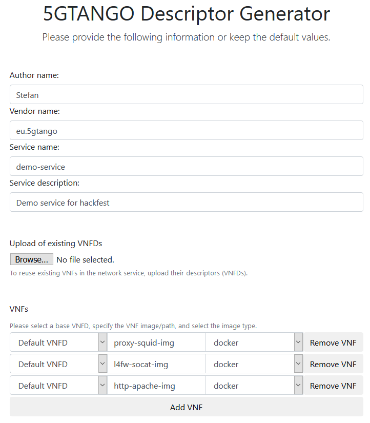

# 5GTANGO SDK Tutorial

This tutorial shows the 5GTANGO SDK, including the full workflow of descriptor generation, project management, validation, packaging, and on-boarding and instantiation on the *vim-emu* emulator.

This tutorial is based on a [demo previously presented at IEEE NFV-SDN 2018](https://github.com/CN-UPB/demo-multi-platform-nfv-sdk).

**Contact information:** [Stefan Schneider](https://github.com/stefanbschneider), Paderborn University

## Setup

To run the full demo, including instantiation of the service on the emulator, you should use Ubuntu 16.04. All previous steps of the demo also work on other operating systems (eg, Windows and Mac OS).

See the [getting started guide](https://sonata-nfv.github.io/sdk-installation) to install the project management, validation, and packaging tool in a Python 3.5+ virtual environment:

```bash
# install
pip install git+https://github.com/sonata-nfv/tng-sdk-project.git
pip3 install git+https://github.com/sonata-nfv/tng-sdk-validation.git
pip3 install git+https://github.com/sonata-nfv/tng-sdk-package

# test
tng-project -h
tng-validate -h
tng-package -h
```

For the last part of the demo, you will also need the *vim-emu* prototyping platform. Follow the install instructions for the [bare-metal installation](https://osm.etsi.org/wikipub/index.php/VIM_emulator#Option_1:_Bare-metal_installation):

```bash
# package requirements
sudo apt-get install ansible git aptitude

# containernet
git clone https://github.com/containernet/containernet.git
cd ~/containernet/ansible
sudo ansible-playbook -i "localhost," -c local install.yml

# vim-emu
git clone https://osm.etsi.org/gerrit/osm/vim-emu.git
cd ~/vim-emu/ansible
sudo ansible-playbook -i "localhost," -c local install.yml
```

## Tutorial walkthrough

### Descriptor generation

To use the graphical descriptor generation, navigate to https://sonata-nfv.github.io/tng-sdk-descriptorgen/ and default values for author, service, and description (keep in mind that vendor and service need to be lowercase strings without spaces).

Finally add VNFs with the following Docker images (in this order!):

* `proxy-squid-img`
* `l4fw-socat-img`
* `http-apache-img`



Click "generate" to generate the descriptors. After a moment, you'll see the generated NSD and VNFDs for our demo service. Our SDK is has multi-platform support and also generates OSM descriptors.

After reviewing (and potentially adjusting) the generated descriptors, download them by clicking "download all".

*Note:* The descriptor generator is also available as CLI tool for advanced users.

### Project management

Extract the downloaded `descriptors.zip` (or take the `descriptors` directory from this repo) and activate your Python virtual environment in which you installed `tng-sdk-project`.

#### Workspace

If you haven't done so before, create a new workspace (containing some configuration files) by typing `tng-wks` in the terminal with the activated virtual environment.

#### Project status

Now, let's have a look at the generated descriptors and downloaded project, using the project management tool:

```bash
$ tng-project -p descriptors --status
2019-01-23 15:16:46 nb-stschn tngsdk.project.project[220] INFO Loading project 'descriptors/project.yml'
Project: generated-project
Vendor: eu.5gtango
Version: 0.1
UUID: baaf9c9b-523a-44b9-8493-b868c4e67e33
Demo service for hackfest
+-------------------------------+------------+
| MIME type                     |   Quantity |
+===============================+============+
| application/vnd.5gtango.nsd   |          1 |
+-------------------------------+------------+
| application/vnd.5gtango.vnfd  |          3 |
+-------------------------------+------------+
| application/vnd.etsi.osm.nsd  |          1 |
+-------------------------------+------------+
| application/vnd.etsi.osm.vnfd |          3 |
+-------------------------------+------------+
```

Using the `tng-project --status` command, you'll get an overview of the involved files: 1 NSD and 3 VNFDs for both 5GTANGO and OSM.

#### Adding a file

Now, let's create add a file to our project. For example, a dummy license file:

```bash
touch descriptors/License.txt
```

To include this file in our project, use the `tng-project --add` command (similar to `git add`):

```bash
$ tng-project -p descriptors --add descriptors/License.txt
2019-01-23 15:22:08 nb-stschn tngsdk.project.project[14016] INFO Loading project 'descriptors\project.yml'
2019-01-23 15:22:08 nb-stschn tngsdk.project.project[14016] INFO Added descriptors/License.txt to project.yml
```

If you run the `status` command again, you'll see that the license file is now part of your project (listed as `text/plain` file).

### Validation

The next step in the SDK workflow is descriptor and project validation to ensure all descriptors are correct. Currently, the validator only works on Linux (not Windows).

#### Validate our project

Validate our project by using the following command:

```bash
$ tng-validate --project descriptors/
CLI input arguments: ['--project', 'descriptors/']
Printing all the arguments: Namespace(api=False, cfile=None, custom=False, dext=None, dpath=None, integrity=False, mode='stateless', nsd=None, package_file=None, project_path='descriptors/', service_address='127.0.0.1', service_port=5001, syntax=False, topology=False, verbose=False, vnfd=None, workspace_path=None)
Project validation
2019-01-23 15:41:54 [INFO] [tngsdk.project.project] Loading project 'descriptors/project.yml'
2019-01-23 15:41:54 [INFO] [tngsdk.validation.validator] Validating project 'descriptors/'
...
2019-01-23 15:41:55 [INFO] [tngsdk.validation.validator] Validating topology of service 'eu.5gtango.demo-service.0.9'
No errors found in project validation
```

Great, it seems like our descriptors are error-free!

#### Introducing and fixing a bug

Feel free to further test the tool by introducing a bug and using the validator to find and fix it again. For example, you can rename one of the connection points of the vLinks in `descriptors/tango_demo-service.yml`:

```yaml
- id: input-2-vnf0
    connectivity_type: E-Line
    connection_points_reference:
      - input
      - 'vnf5:input'	# bug: vnf5 is not defined
```

When running the validation again, it should warn you about the error:

```bash
2019-01-23 15:58:26 [ERROR] [validator.events] Undefined connection point
2019-01-23 15:58:26 [ERROR] [validator.events] Function (VNF) of vnf_id='vnf5' declared in connection point 'vnf5' in virtual link 'input' is not defined
```

Now it is easy to identify and fix the error again.

### Packaging

### Emulation

